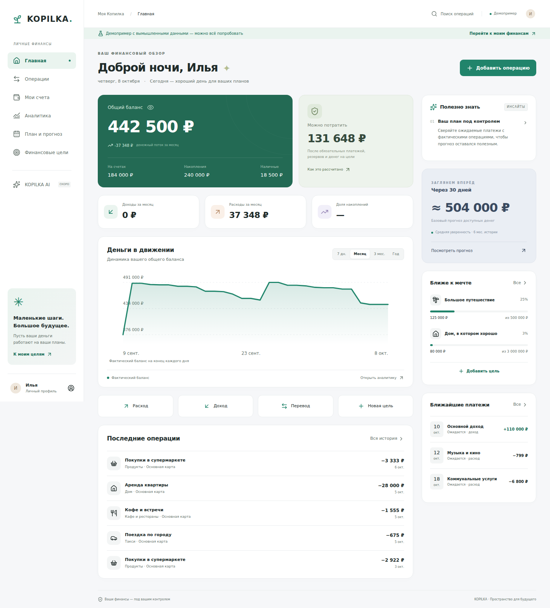

# KOPILKA

Персональная финансовая система: учёт → понимание → прогноз → решения.

**Текущий этап: рабочее local-first приложение без подключения Supabase.** Регистрация, облачная синхронизация и многопользовательский доступ намеренно отложены. Это проверяемый первый этап продукта, а не заявление о готовности всей спецификации к коммерческому запуску.



## Что работает

- Первичная настройка имени, валюты, баланса и финансовых ориентиров.
- Счета: создание, архивирование, RUB/USD/EUR, включение в общий баланс.
- Расходы, доходы, переводы, корректировки; комментарии, обязательные/импульсивные расходы.
- История с поиском, датами, категориями, счетами, типами, пагинацией по 25 записей.
- Подтверждаемое удаление операции с пересчётом баланса.
- Бюджеты категорий, изменение лимита, прогноз перерасхода.
- Цели, расчёт месячного взноса, резервирование уже имеющихся денег, архивирование.
- Ежемесячные шаблоны доходов/расходов, календарь, подтверждение/пропуск, пауза.
- Прогноз на 7/30/90/180/365 дней, три сценария, предупреждение о кассовом разрыве.
- Safe-to-spend и объяснение вычетов, расчёт влияния покупки.
- Категории, cash flow, динамика баланса, 13-недельная heatmap, простые инсайты.
- Отдельный воспроизводимый демопример с шестью полными месяцами истории.
- CSV операций по текущим фильтрам; JSON backup/restore с проверкой схемы и связей.
- Светлая/тёмная/системная тема, скрытие сумм, мобильная навигация и bottom sheets.
- PWA, PNG-иконки, iPhone safe areas, офлайн-загрузка основных страниц.
- Полное удаление данных устройства с явным подтверждением.

Кнопка KOPILKA AI явно помечена «Скоро»; вызовов LLM и платёжных сервисов нет.

## Стек и архитектура

Next.js 16.4 App Router, React 19, TypeScript, Tailwind 4 + CSS tokens, Lucide, Zod, date-fns, Vitest, Playwright. Небольшие SVG-визуализации не требуют тяжёлого графического runtime. Суммы — целые минимальные единицы (копейки/центы).

```text
app/(app)/                 маршруты приложения
components/local/          экранные компоненты, формы, charts, доступные диалоги
lib/local/model.ts         Zod-схемы и типы локального документа v1
lib/local/repository.ts    адаптер хранения; точка замены на серверный repository
lib/local/finance.ts       чистые расчёты и переходы состояния
lib/local/demo.ts          воспроизводимый изолированный демонабор
lib/finance/               общее финансовое ядро, форматирование денег
lib/supabase/              сохранённый код предыдущего Foundation, сейчас не подключён
supabase/schema.sql        прежняя схема-кандидат, не применялась к серверу
public/sw.js               кеш только оболочек локального приложения и static assets
lib/**/*.test.ts           unit/integration проверки домена
tests/e2e/                 реальные сценарии браузера
```

Баланс всегда восстанавливается из `initialMinor + ledger`. UI не хранит второй изменяемый баланс. Запись всего документа атомарна через localStorage; Web Locks сериализуют изменения между вкладками в поддерживаемых браузерах. События `storage` обновляют другие вкладки. В браузере без Web Locks одновременное редактирование в нескольких вкладках не поддерживается — используйте одну вкладку.

Отдельные ключи `kopilka.personal.v1` и `kopilka.demo.v1` исключают смешивание демоданных и личной истории. Полное удаление удаляет оба набора. При ошибке чтения исходный документ не перезаписывается.

## Запуск

Node.js 24 LTS, npm. Ключи и серверная БД не нужны.

```bash
npm ci
npm run dev
# http://localhost:3000
```

Первый экран предлагает настроить свои финансы или открыть демопример. Личные данные не заполняются автоматически.

```bash
npm run typecheck
npm run lint
npm run test
npm run build
npm run start -- --hostname 0.0.0.0
```

## Тестирование

```bash
npm run check
npm run build
npx playwright install chromium
npm run test:e2e
```

`PLAYWRIGHT_CHROMIUM_EXECUTABLE` позволяет указать установленный Chromium, если скачивание браузера ограничено средой. CI использует стандартный Playwright Chromium.

Доменные проверки покрывают финансовые инварианты, идемпотентность, валюты, некорректные связи, прогноз, архивирование, короткие месяцы, leap year, timezone и demo seed. E2E проверяет onboarding → счёт → расход → перевод → доход → цель → бюджет → регулярный платёж; backup, изоляцию demo, удаление, темы, manifest, offline reload и сохранение.

Адаптивность проверяется для 375, 390, 430, 768, 1024 и 1440 px на всех восьми основных экранах.

## Формулы и допущения

- `CashFlow = Income − Expenses`; transfer и adjustment исключены.
- `SavingsRate = (Income − Expenses) / Income × 100`; без дохода UI показывает «—».
- `SafeToSpend = max(0, LiquidBalance − ExpectedMandatoryBills − GoalReserves − MinimumEmergencyReserve)`.
- LiquidBalance исключает вклады/инвестиции и счета, отключённые от общего баланса. Разные валюты не складываются; FX не реализован.
- Ближайшие обязательства: неоплаченные регулярные расходы до следующего регулярного дохода в пределах 30 дней, иначе 30 дней, включая просроченные расходы. Незаписанный в расписание платёж не может быть учтён как точное обязательство.
- `MinimumEmergencyReserve = max(оценка пользователя, средние исторические обязательные расходы) × желаемые месяцы`.
- `EmergencyMonths = savings accounts / average mandatory monthly expenses`. Целевые резервы и подушка должны быть разными назначениями денег.
- Goal monthly contribution: остаток / оставшиеся календарные месяцы, округление вверх до копейки; минимум один период. При прошедшем сроке показан весь остаток, новый срок нужно задать отдельной целью.
- Budget projection: расход / прошедшие дни × дни месяца.
- Forecast: ликвидный баланс + подтверждаемое расписание − средние переменные траты − оценка обязательных трат, ещё не покрытых шаблонами. Просроченные расходы ставятся на следующий день; просроченный доход исключён до подтверждения. Доход без расписания автоматически не прогнозируется.
- Без истории переменные расходы оцениваются как 50% разницы между заявленным доходом и обязательными расходами. Это явное осторожное стартовое допущение, не персональная рекомендация.
- Осторожный сценарий: регулярный доход × 0.9, переменные расходы × 1.2. Оптимистичный: переменные × 0.85. Сезонности пока нет.
- Confidence — эвристика по длине истории, а не статистическая вероятность. Прогнозы округляются до тысяч; фактические суммы точные.

Финансовая дата — отдельное `YYYY-MM-DD` в часовом поясе пользователя; `createdAt` — UTC ISO timestamp. Перевод между разными валютами запрещён до появления явного FX курса. Изменение основной валюты при активных целях или бюджетах блокируется, чтобы не менять смысл сумм.

## Повторяющиеся операции

Шаблон не является фактом. `templateId:occurrenceDate` — ключ подтверждения: повторное нажатие не создаёт дубль. Будущий платёж нельзя подтвердить заранее; его можно пропустить. Для 29/30/31-го числа в коротком месяце используется последний день; исходный день в следующем месяце сохраняется. Удаление подтверждённого факта возвращает ожидание в план.

## PWA и развёртывание

Соберите приложение и разверните как Next.js Node-приложение на HTTPS-хостинге. Подойдут хостинги с поддержкой Next.js 16 и Node 24. Без конкретного выбранного хостинга автоматическая публикация не выполнялась.

Service Worker включён только в production. Кеширует оболочки маршрутов и JS/CSS/иконки; финансовые записи берутся из локального хранилища. API и auth ответы не кешируются. HTTPS (или localhost) необходим для PWA. При обновлении приложения увеличивайте версию CACHE в `public/sw.js`.

На iPhone: Safari → Поделиться → На экран Домой. На Android — установка из меню браузера. Нативный Face ID/PIN, push, удалённый backup не реализованы. Проверка физического iPhone/Safari перед публичным выпуском остаётся обязательной.

## Environment variables и будущий Supabase

`.env.example` содержит только пустые placeholders. В текущем режиме заполнять их не требуется. Supabase-проект, SQL и RLS в этом этапе не создавались и не менялись.

Перед включением облачного режима нужно завершить и проверить schema migrations, RLS для двух пользователей, атомарные RPC, cookie sessions, email confirmation/recovery, перенести локальные записи, проверить удаление аккаунта и отключить кеш персонализированных серверных ответов. **Просто добавить ключи недостаточно для переключения на облачную работу.**

Никогда не включайте service-role, секретные ключи или пароли в `NEXT_PUBLIC_*` и Git. Сохранённый auth/SQL код не считается прошедшим серверную приёмку.

## Безопасность и ограничения текущего этапа

Локальные данные не передаются Supabase, AI или банкам. Хранилище браузера не зашифровано и доступно пользователю устройства; очистка браузера удаляет историю. Регулярно экспортируйте JSON. Не используйте общее устройство для реальных чувствительных данных. Локальная версия не обещает серверную изоляцию и авторизацию, пока сервер не подключён.

CSV экранирует ячейки и нейтрализует spreadsheet formulas. JSON импорт ограничен 10 MB, проверяет версию, суммы и связи. React экранирует пользовательский текст. Чеки и банковские интеграции отсутствуют. Локальная пагинация не заменяет будущую серверную пагинацию: сейчас документ загружается целиком и рассчитан на ограниченную личную историю, не на десятки тысяч записей.

## Roadmap

1. **Текущий этап:** локальный учёт, planning, базовая аналитика, PWA, тестируемый домен.
2. **Cloud Foundation:** Supabase Auth, миграции, RLS, серверные транзакции, синхронизация, полный onboarding и серверная пагинация.
3. **Расширенная аналитика:** произвольные периоды, Sankey/bubble, сравнение одинаковых частей месяца, financial score, достижения, anomaly detection, Financial Twin.
4. **Умное планирование:** отдельные разовые planned transactions, frequencies, редактирование операций/целей/шаблонов, tags/receipts, сезонность, What-if.
5. **AI и Premium:** серверные агрегаты и безопасные tools, явное согласие на передачу агрегатов, feature flags, подписка. Никаких выдуманных финансовых цифр.

Подробности исходного аудита: [docs/AUDIT.md](docs/AUDIT.md).
